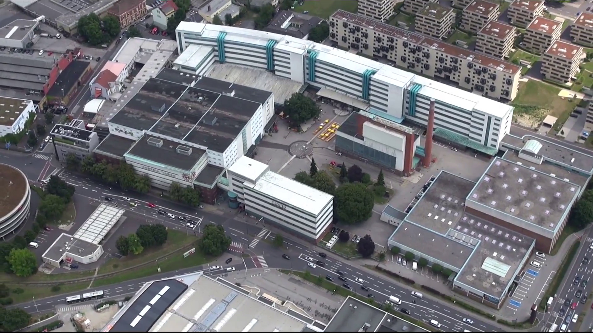

# Kaplanhof
Der Kaplanhof ist ein statistischer Bezirk in **Linz**. Er befindet sich östlich der Innenstadt (Bezirk Innere Stadt). Er behergt die (ehemalige) Tabakfabrik sowie Teile des Kepler Universitäts Klinikums (ehemals AKH, UKH, Landes Frauen- und Kinderklinik).

*Luftaufnahme Tabakfabrik [1]*

## Lage
Der Bezirk liegt im Linzer Zentrum, östlich bis nordöstlich des Bezirks Innere Stadt.

Seine Grenzen sind:

* im Westen: die Gruberstraße, die Khevenhüllerstraße
* im Süden: die Prinz-Eugen-Straße
* im Osten: die Mühlkreis Autobahn (Prinz-Eugen-Straße bis  Derfflingerstraße), die Industriezeile (nördlich der Derfflingerstraße)
* im Norden: die Donau, im Nordosten auch der Winterhafen

## Demografie
Fläche: 243,20 ha (2,53 %)
Einwohner: 9758 (4,92 %)
Gebäude: 830 (3,53 %)
Wohnungen: 6021 (5,34 %)
_(in % von ganz Linz)_

## Frühere Einteilung
Der Bezirk Kaplanhof wurde per 1. Jänner 2014 aus mehreren der alten Bezirke zusammengesetzt. Im Kern umfasst es das Gebiet des alten Kaplanhofviertels.

Er wurde gebildet aus den Bezirken:

* Kaplanhofviertel (außer dessen Gebiete westlich der Gruberstraße)
* Franckviertel (die Gebiete zwischen Derfflingerstraße/Weißenwolffstraße und Prinz-Eugen-Straße, abgesehen vom AKH)
* Hafenviertel (Gebiet östlich der Köglstraße)
* Rathausviertel (im wesentlichen das Parkbad-Gelände)

___
## Quellen
[linzwiki.at](http://www.linzwiki.at/wiki/Bezirk_Kaplanhof/)

[1] *Von Stadt Linz / Screenshot: Christoph Waghubinger (Lewenstein) - Diese Datei ist ein Ausschnitt aus einer anderen Datei: Stadt Linz - Tabakfabrik Linz.webmMediendatei abspielenScreenshot bei 00:00:20(YouTube: Tabakfabrik Linz), CC BY 3.0, https://commons.wikimedia.org/w/index.php?curid=64362346*