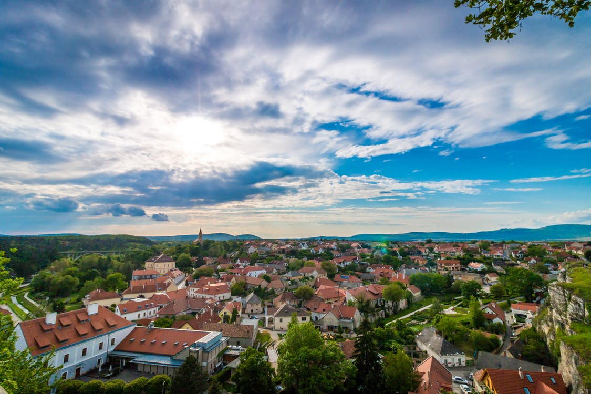

# Lochen am See
Lochen am See grenzt an den Mattsee auf einem Hochplateau, wobei der Tannberg im Süden der Gemeinde liegt. Die Gemeinde hat eine Fläche von 33,3 km².

# Geschichte
Bereits aus der Jüngeren Steinzeit liegen Depotfunde in Lochen vor. In der Folge sind auch Funde aus der Hallstattzeit und der La-Tène-Zeit nachzuweisen, in denen Illyrer und Kelten das Land besiedelten. Römische Siedlungen konnten auch in Lochen gesichert werden, wobei hier die Straße nach Castra Batava (Passau) verlief. Nach der Völkerwanderungszeit besiedelten Bajuvaren ab dem 6. Jahrhundert das Gebiet.

Lochen wurde das erste Mal im Jahre 903 in einer Schenkungsurkunde des Bischofs Madalwin urkundlich erwähnt. Lochen gehörte – wie aus einer Personalzinsurkunde hervorgeht – zum Stift Mattsee. Durch den Frieden von Teschen im Jahre 1779 kam das gesamte damalige Innbaiern mit Lochen von Bayern zu Österreich. Im Zuge dieser Veränderung kam Lochen 1785 von der Diözese Passau zur 1785 neu gegründeten Diözese Linz.

Lochen wurde im Jahr 1974 als Standort für den Flughafen Salzburg vorgeschlagen. Die Gemeinde nennt sich erst seit jüngster Zeit Lochen am See. Das soll darauf Bezug nehmen, dass sich das Gemeindegebiet bis an den Mattsee erstreckt, der zum Bundesland Salzburg gehört. Diese Tatsache ist im Raum relativ unbekannt. Der Hauptort selbst liegt nicht am See.

Quelle: https://de.wikipedia.org/wiki/Lochen_am_See

